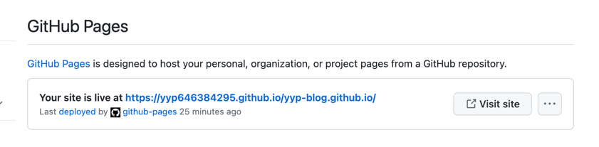
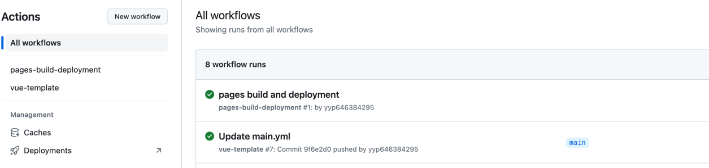

# GitHub Actions使用方法
这篇文章记录使用github actions、github pages实现部署项目功能

## 开始

1. 登录到你的github首页，选择创建新仓库(New repository)
2. 仓库命名格式为：`projectName.github.io`
3. 创建仓库成功后，将项目源代码提交到改仓库

> 注意:项目需要进行开源才可以使用`GitHub Pages`功能

## 检查
1. 将代码提交到仓库后，我们需要到仓库的Settings/Pages查看github是否有给我们开了页面

2. 这是可以点击`Visit site`确定是否可访问该项目

## Actions
1. 点击仓库中的`Actions`选择创建模版`Simple workflow`，脚本文件命名为main.yml
2. 这时候会在项目根目录中创建一个`.github/workflows`目录
3. 进入`.github/workflows`目录，开始编写脚本执行文件。
4. 更改提交后，点击actions查看脚本执行结果。
5. 成功后可访问Settings/Pages中的域名地址。

> 访问地址：https://github账户名.github.io/仓库名/

### main.yml
```yml
name: vue-template # 脚本名称
on:
  push:
    branches:
      - main # 当提交到main分支后开始执行
jobs:
  build-and-deploy:
    runs-on: ubuntu-latest
    steps:
      - uses: actions/checkout@v3 # 下载所需依赖
      - uses: actions/setup-node@v1
        with: 
          node-version: '14.x' # 指定node版本
      - name: ENV
        run: |
          node -v
          npm -v
          npm config set registry https://registry.npm.taobao.org
      - name: Install and Build   # 安装依赖、打包，如果提前已打包好无需这一步
        run: |   
          npm install
          npm run build

      - name: Deploy   # 部署
        uses: JamesIves/github-pages-deploy-action@v4.3.3
        with:
          branch: gh-pages # 部署后提交到那个分支
          folder: dist # 这里填打包好的目录名称
```

